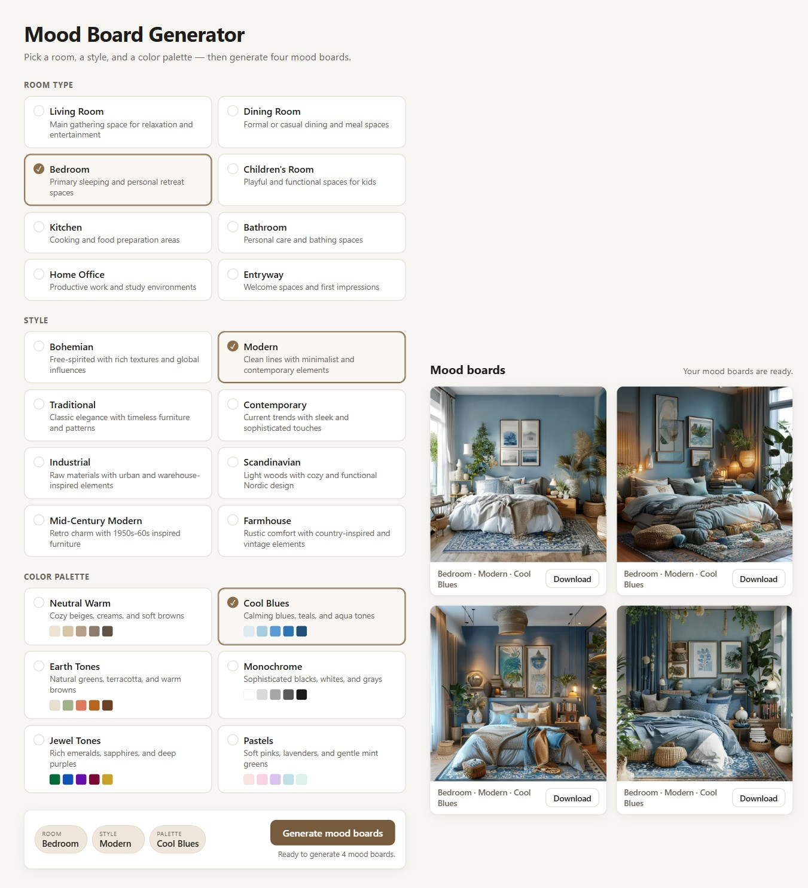

# Mood Board Generator

A single-page web app for an interior-design firm. Pick a **room type**, a **style**, and a
**color palette**, then generate **four distinct, photoreal mood board images** that match the
brief (e.g. *Kitchen + Traditional + Pastels* → four fully-furnished pastel-kitchen boards).

Built with **React + Vite + TypeScript**. Images come from the free, keyless
[Pollinations.ai](https://pollinations.ai) text-to-image API, called directly from the
browser — no backend, no API key.



## Getting started

```bash
npm install
npm run dev        # http://localhost:5173
```

## Scripts

| Script | What it does |
|--------|--------------|
| `npm run dev` | Start the Vite dev server on port 5173 |
| `npm run build` | Type-check and build to `dist/` |
| `npm run preview` | Serve the production build |
| `npm run lint` | ESLint (zero warnings allowed) |
| `npm run test:unit` | Vitest unit tests |
| `npm run test:e2e` | Playwright end-to-end tests (stubs the image API) |

## How it works

1. **Selection** — three accessible ARIA radiogroups (single-select) drive the brief.
   Generate stays disabled until all three are chosen.
2. **Prompt** — `lib/prompt.ts` builds a deterministic prompt from the selected room, style,
   and the palette's fixed hex tones. Only whitelisted option values reach it.
3. **Generation** — `lib/generate.ts` produces four boards with distinct seeds **and**
   distinct composition/lighting/styling phrases (four genuinely different directions), each
   prompting for richly styled decorative artifacts. `hooks/useMoodboards.ts` runs a
   **bounded-concurrency queue** — by default fully sequential (one request at a time) with
   exponential-backoff retries, because Pollinations gates browser requests to ~2 per short
   window; sequential requests stay under the limit so all four boards succeed (~40–50s total).
   Timings are tunable via `window.__MB_CONFIG__` (see `lib/config.ts`).
4. **Layout & results** — a full-width **two-pane** layout (controls beside results) on
   desktop, stacking on mobile; a 2×2 board grid with per-board loading skeletons, an error
   tile + Retry, per-board download, and a "selections changed — regenerate" stale state.

The image backend sits behind a small `ImageProvider` interface
(`lib/imageProvider.ts`), so a keyed provider could be swapped in later (behind a proxy).

## Project structure

```
src/
  data/options.ts       # the three option lists + fixed palette hex swatches
  lib/                  # prompt, imageProvider, generate, selection, download (pure logic)
  hooks/useMoodboards.ts# batch state machine (stagger + retry)
  components/           # OptionGroup, SelectionPanel, GenerateBar, BoardGrid, BoardCard
  test/                 # Vitest unit tests
e2e/                    # Playwright specs + fixtures
specs/001-mood-board-generator/  # spec-driven-development artifacts
```

## Notes

- Generation needs internet access to Pollinations at runtime; failures surface as an error
  tile with Retry. E2E tests intercept the image requests and serve a local fixture, so they
  run offline and deterministically.
- No accounts, secrets, or personal data are collected or stored.
